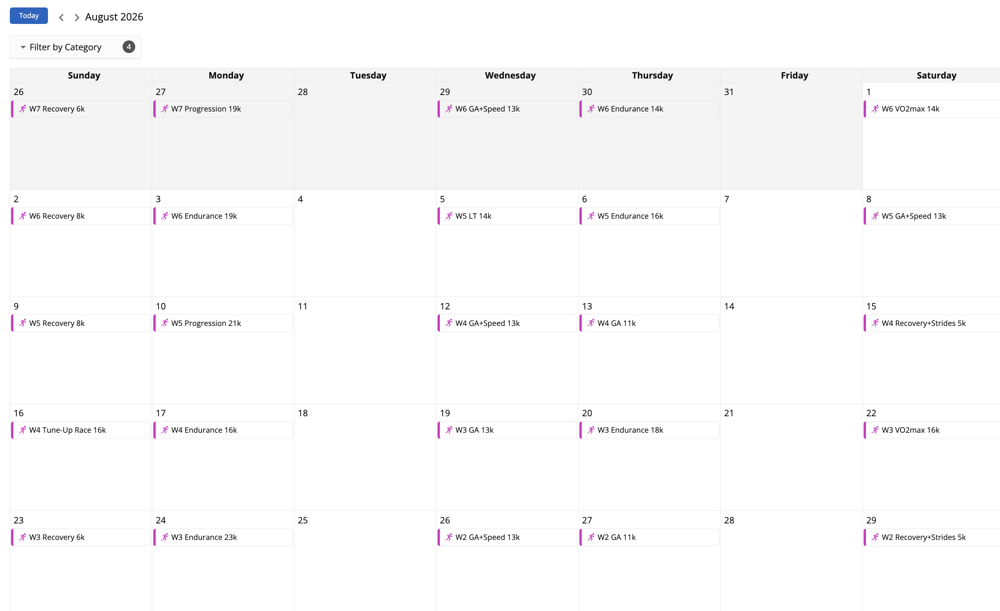
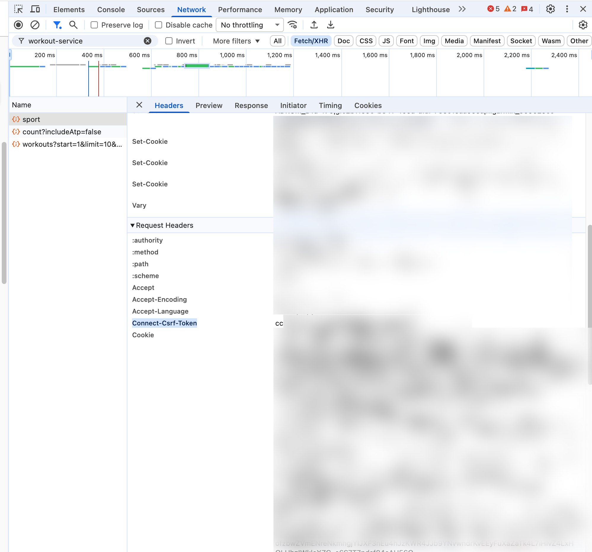
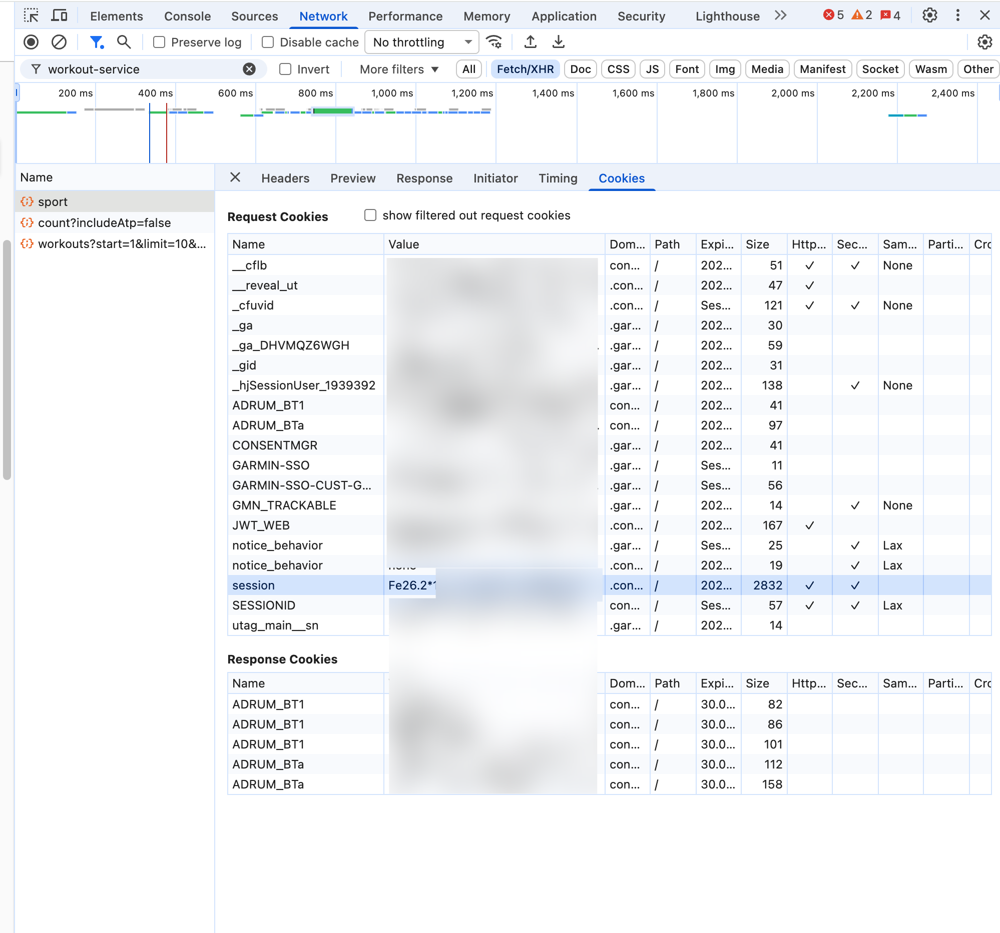

# Garmin Training Tool

Create and schedule structured running workouts on Garmin Connect from simple YAML training plans. Define your workouts once, upload them all, and see them on your watch calendar.



## Why This Exists

Garmin Connect's web interface makes you create workouts one at a time. If you're following a structured plan (Pfitzinger, Daniels, Hanson, etc.), that means clicking through 50+ workouts manually. This tool lets you define your entire plan in a YAML file and upload everything in one shot.

## Features

- Define workouts with pace targets, heart rate zones, intervals, and repeats
- Schedule workouts to specific calendar dates
- Validate plans locally before uploading
- Simple YAML format that's easy to read and modify

## Prerequisites

- Python 3.9+
- [uv](https://docs.astral.sh/uv/) (recommended) or pip
- A Garmin Connect account

## Installation

```bash
git clone https://github.com/YOUR_USERNAME/garmin-training-tool.git
cd garmin-training-tool
uv sync
```

Or with pip:

```bash
pip install -e .
```

## Authentication Setup

> **Important:** Garmin recently added Cloudflare TLS fingerprinting that blocks all non-browser HTTP clients. This means libraries like `garth`, `garminconnect`, and most Garmin API tools no longer work for write operations. This tool uses your browser session cookies instead.

### Getting Your Session Credentials

You need two values from your browser: a **session cookie** and a **CSRF token**.

#### Step-by-step:

1. Open **https://connect.garmin.com** in Chrome or Firefox
2. Log in to your account
3. Open **Developer Tools** (F12 or Cmd+Option+I on Mac)
4. Go to the **Network** tab
5. Navigate to the **Workouts** page (connect.garmin.com/modern/workouts)
6. In the Network tab, filter requests by typing `workout-service`
7. Click on any request to a URL containing `workout-service`
8. In the **Headers** tab, scroll to **Request Headers** and find:

   **`connect-csrf-token`** — a short UUID like `cc526168-e8b9-4b6f-b77f-ce0e5c14d038`

   

9. Switch to the **Cookies** tab and find:

   **`session`** — the value starts with `Fe26.2*...` (it's very long). Copy the entire value.

   

#### Quick Setup (interactive):

```bash
uv run garmin-training-tool setup
```

This will prompt you for the values and create `session.json`.

#### Manual Setup:

Create a `session.json` file in your working directory:

```json
{
  "session_cookie": "Fe26.2*1*your-long-session-cookie-here...",
  "csrf_token": "your-csrf-token-here",
  "extra_cookies": {
    "GARMIN-SSO-CUST-GUID": "your-guid-if-needed"
  }
}
```

> **Note:** Session cookies expire after a few days. If you get errors, grab fresh values from your browser.

> **Security:** `session.json` is in `.gitignore` — never commit it.

## Usage

### Quick Start with Preset Plans

The fastest way to get started — use a built-in training plan and just specify your race date:

```bash
# See available plans
uv run garmin-training-tool presets

# Validate a plan (see what dates it would schedule)
uv run garmin-training-tool validate pfitz-half-12-47 --race-date 2026-09-13

# Import to Garmin Connect
uv run garmin-training-tool import pfitz-half-12-47 --race-date 2026-09-13
```

The tool calculates all training dates backwards from your race date and schedules everything automatically.

#### Available Presets

| Preset | Distance | Weeks | Level |
|--------|----------|-------|-------|
| `pfitz-half-12-47` | Half Marathon | 12 | Intermediate |
| `higdon-half-novice1` | Half Marathon | 12 | Beginner |
| `hansons-half-beginner` | Half Marathon | 18 | Beginner-Intermediate |
| `higdon-marathon-novice1` | Marathon | 18 | Beginner |

### Custom Plans

#### Validate a Plan

Check your YAML is correct without uploading anything:

```bash
uv run garmin-training-tool validate examples/5k_plan.yaml
```

#### Import a Plan

Upload workouts and schedule them:

```bash
uv run garmin-training-tool import my_plan.yaml
```

Create workouts without scheduling:

```bash
uv run garmin-training-tool import my_plan.yaml --no-schedule
```

### List Workouts

See what's already on your account:

```bash
uv run garmin-training-tool list
```

## Writing Training Plans

Plans are YAML files with three sections: **paces**, **workouts**, and **schedule**.

### Paces

Define your training paces as ranges (slow-fast) in min:sec per km:

```yaml
paces:
  easy: "5:30-6:00"
  tempo: "4:15-4:35"
  vo2max: "3:50-4:10"
  strides: "3:15-3:40"
```

### Workouts

Each workout is a list of steps. Step types: `warmup`, `run`, `recovery`, `cooldown`.

```yaml
workouts:
  Tempo 8k:
    - warmup: 2000m z2
    - run: 20min $tempo
    - cooldown: 2000m z2
```

#### Step Format

Each step has a **duration/distance** and a **target**:

```
- step_type: condition target
```

**Conditions (duration/distance):**
- Distance: `1000m`, `5km`, `5k`
- Time: `30s`, `5min`, `20min`
- Lap button: `lap`

**Targets:**
- Heart rate zone: `z1`, `z2`, `z3`, `z4`, `z5`
- Pace reference: `$easy`, `$tempo`, `$vo2max` (from your paces section)
- Inline pace: `4:30-5:00`
- No target: `none` (or omit the target)

#### Repeats

```yaml
workouts:
  VO2max 5x1000:
    - warmup: 2000m z2
    - repeat(5):
      - run: 1000m $vo2max
      - recovery: 3min z2
    - cooldown: 2000m z2
```

#### Progression Runs

Just stack steps with increasing intensity:

```yaml
workouts:
  Progression 15k:
    - warmup: 1000m z2
    - run: 8000m z2
    - run: 3000m z3
    - run: 3000m $tempo
```

### Schedule

Schedule workouts to dates. Use `rest` for rest days:

```yaml
schedule:
  start: "2026-07-06"
  days:
    # Week 1
    - rest
    - Easy 5k
    - Tempo 8k
    - rest
    - VO2max 5x1000
    - rest
    - Long Run 16k
```

Each entry corresponds to one day, starting from `start`. The workout name must exactly match a name in the `workouts` section.

## Full Example

```yaml
paces:
  easy: "5:30-6:00"
  tempo: "4:20-4:40"
  vo2max: "3:50-4:10"
  strides: "3:15-3:40"

workouts:
  Easy 8k:
    - warmup: 1000m z2
    - run: 6000m z2
    - cooldown: 1000m z1

  Tempo 10k:
    - warmup: 2000m z2
    - run: 24min $tempo
    - cooldown: 2000m z2

  VO2max 5x1000:
    - warmup: 2000m z2
    - repeat(5):
      - run: 1000m $vo2max
      - recovery: 3min z2
    - cooldown: 2000m z2

  Easy + Strides:
    - warmup: 1000m z2
    - run: 5000m z2
    - repeat(6):
      - run: 100m $strides
      - recovery: 200m z1
    - cooldown: 1000m z2

  Long Run 16k:
    - warmup: 1000m z2
    - run: 14000m z2
    - cooldown: 1000m z1

schedule:
  start: "2026-07-06"
  days:
    - rest
    - Easy 8k
    - Tempo 10k
    - rest
    - Easy + Strides
    - rest
    - Long Run 16k
```

## Customizing Preset Paces

Preset plans come with default pace targets. To customize them for your fitness level, copy the preset and edit the `paces` section:

```bash
cp $(uv run python -c "from garmin_training_tool.presets import get_preset_path; print(get_preset_path('pfitz-half-12-47'))") my_plan.yaml
```

Then edit `my_plan.yaml` and change the paces:

```yaml
paces:
  easy: "5:00-5:30"       # adjust to your easy pace
  lt: "4:00-4:15"         # adjust to your threshold pace
  vo2max: "3:35-3:55"     # adjust to your VO2max pace
  ...
```

And add a fixed schedule instead of using `--race-date`:

```yaml
# Replace schedule_template with:
schedule:
  start: "2026-06-23"
  days:
    - rest
    - GA+Speed 10k
    # ... etc
```

## Troubleshooting

### "Your session may have expired"
Your browser cookies have expired. Open Garmin Connect in your browser, navigate to the workouts page, and grab fresh `session` cookie and `connect-csrf-token` values.

### "Failed to spawn: garmin-training-tool"
If using `uv`, make sure you're in the project directory and run:
```bash
uv sync
```
Then use `uv run garmin-training-tool` (not just `garmin-training-tool`).

Alternatively, run as a module:
```bash
uv run python -m garmin_training_tool
```

### Workouts created but not visible on watch
Garmin watches sync scheduled workouts from your calendar. Make sure:
1. Workouts are **scheduled** (not just created)
2. Your watch has synced with Garmin Connect (via Bluetooth or Wi-Fi)
3. On your watch: navigate to the workout/training calendar to see upcoming workouts

### Why not use garth/garminconnect libraries?
As of mid-2025, Garmin added Cloudflare TLS fingerprinting to `connect.garmin.com`. This blocks all non-browser HTTP clients at the TLS handshake level, regardless of valid credentials. Session cookies from a real browser bypass this because the requests library's TLS fingerprint isn't checked for cookie-authenticated requests to the `/gc-api/` endpoint.

## Contributing

PRs welcome. Some ideas:
- More preset plans (Pfitzinger marathon, Daniels, 80/20, etc.)
- Cycling workout support (power targets)
- Import from spreadsheet formats
- Support for swimming workouts
- Auto-refresh session via browser automation (Playwright)
- Pace calculator based on recent race time

## License

MIT
